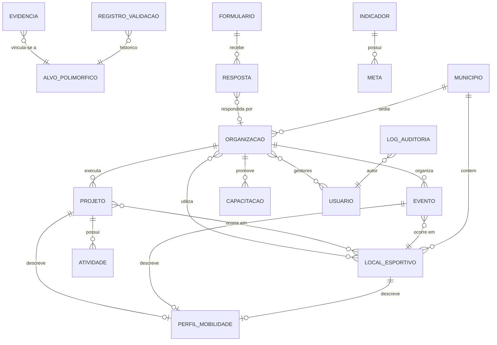
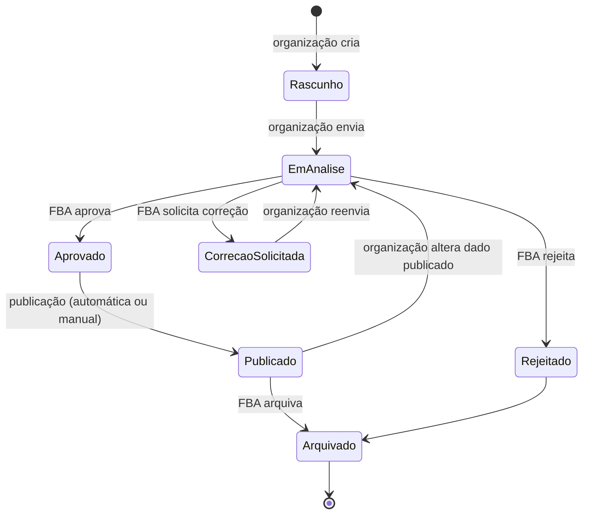
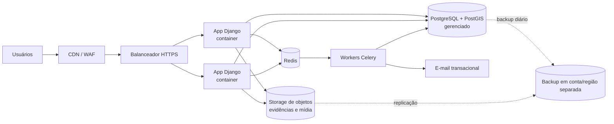
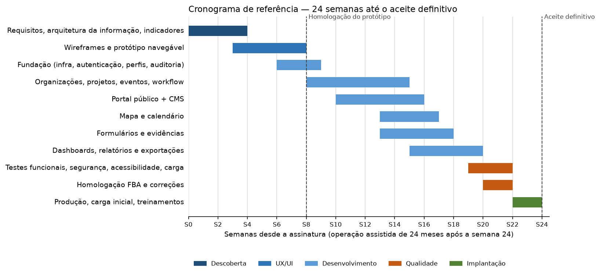

# Observatório FBA do Esporte Social e da Mobilidade
## Documento de Requisitos Refinados — Plataforma Tecnológica

| Campo | Informação |
|---|---|
| Contratante | Federal Brasil Automobilidade Global – FBA Global (CNPJ 57.850.031/0001-59) |
| Proponente | NatGED |
| Documento de origem | Termo de Referência para Cotação — Plataforma Tecnológica do Observatório FBA (Goiânia/GO, 2026) |
| Finalidade deste documento | Refinar o TR em requisitos verificáveis, registrar premissas e decisões de escopo e servir de base técnica para a proposta comercial (Anexo I da Proposta Comercial NatGED) |
| Versão | 0.1 |
| Data | 24/09/2026 |

---

## Sumário

1. [Introdução](#1-introdução)
2. [Premissas e decisões de escopo](#2-premissas-e-decisões-de-escopo)
3. [Perfis de usuário e matriz de permissões](#3-perfis-de-usuário-e-matriz-de-permissões)
4. [Modelo conceitual de dados](#4-modelo-conceitual-de-dados)
5. [Requisitos funcionais](#5-requisitos-funcionais)
6. [Requisitos não funcionais](#6-requisitos-não-funcionais)
7. [Arquitetura proposta](#7-arquitetura-proposta)
8. [Serviços de terceiros e custos recorrentes](#8-serviços-de-terceiros-e-custos-recorrentes)
9. [Fora do escopo e itens opcionais](#9-fora-do-escopo-e-itens-opcionais)
10. [Dependências e responsabilidades da FBA Global](#10-dependências-e-responsabilidades-da-fba-global)
11. [Pontos a esclarecer com a FBA Global](#11-pontos-a-esclarecer-com-a-fba-global)
12. [Plano de fases e entregáveis](#12-plano-de-fases-e-entregáveis)
13. [Matriz de rastreabilidade](#13-matriz-de-rastreabilidade)

---

## 1. Introdução

### 1.1 Objetivo da plataforma

Instrumento tecnológico do Observatório para **coletar, organizar, validar, analisar e divulgar** dados sobre esporte social, organizações, projetos, eventos, públicos, territórios, acessibilidade e mobilidade, apoiando a FBA Global na produção de indicadores, estudos e relatórios e no acompanhamento das organizações participantes (TR §3).

### 1.2 Visão geral da solução

A solução é composta por quatro frentes que compartilham uma única base de dados:

| Frente | Público | Resumo |
|---|---|---|
| **Portal público** | Visitantes (sem login) | Institucional, catálogo de organizações/projetos/eventos, mapa, calendário, indicadores, publicações, notícias e contato |
| **Área restrita** | Organizações participantes | Perfil institucional, projetos, eventos, evidências, formulários, relatórios dos próprios dados |
| **Painel administrativo** | Equipe técnica e administradores FBA | Validação, gestão de cadastros, formulários, conteúdo (CMS), indicadores, relatórios, usuários, auditoria |
| **API** | Integrações futuras | API REST documentada e autenticada |

### 1.3 Dimensionamento de referência (TR §4)

| Item | Capacidade inicial | Margem de projeto |
|---|---|---|
| Organizações | 100 | Arquitetura sem limite lógico; testado com 1.000 |
| Projetos/iniciativas | 150 | Testado com 1.500 |
| Eventos | 200 | Testado com 2.000 |
| Municípios | 20+ | Base IBGE completa (5.570) carregada |
| Gestores de organizações | 200 | — |
| Usuários administrativos FBA | até 15 | — |
| Armazenamento | ≥ 10 GB | Storage de objetos elástico |
| Usuários simultâneos | 200 | Teste de carga com 200 usuários |

### 1.4 Convenções

- **IDs**: `RF-xx.yy` (funcional), `RNF-xx.yy` (não funcional), `P-xx` (premissa), `Q-xx` (questão em aberto).
- **Prioridade (MoSCoW)**: **M** = obrigatório (exigido no TR); **S** = deveria (recomendado, incluído no preço); **C** = poderia (opcional, cotado à parte).
- **Ref. TR**: seção do Termo de Referência que originou o requisito.

### 1.5 Glossário

| Termo | Definição |
|---|---|
| Organização | Pessoa jurídica (ou coletivo) que executa ações de esporte social e participa do Observatório |
| Projeto / iniciativa | Ação continuada de uma organização (ex.: escolinha de futebol, programa de natação adaptada) |
| Evento | Acontecimento com data definida (ex.: torneio, corrida, festival) |
| Local esportivo | Espaço físico onde ocorrem projetos/eventos (quadra, praça, ginásio) |
| Atividade | Ocorrência registrada no âmbito de um projeto (ex.: oficina, turma, encontro) — ver P-07 |
| Evidência | Arquivo ou link que comprova a execução/resultado de algo cadastrado |
| Capacitação | Ação formativa (curso, oficina) promovida pela FBA ou pela organização, com contagem de capacitados — ver P-08 |
| Registro validado | Registro aprovado pela FBA; apenas registros validados alimentam o portal público e os indicadores |

---

## 2. Premissas e decisões de escopo

Estas premissas resolvem ambiguidades do TR e **delimitam o escopo e o preço** da proposta.

| ID | Premissa | Justificativa / origem |
|---|---|---|
| P-01 | Modalidade: **desenvolvimento sob encomenda**, com entrega de código-fonte, banco de dados, documentação e credenciais; **cessão dos direitos patrimoniais** do código específico à FBA Global. Bibliotecas de terceiros permanecem sob suas licenças open source. | TR §9 — preferência explícita da contratante |
| P-02 | Stack **100% open source**, sem licenças de software com custo recorrente. | TR §8 e §18 — minimiza custos recorrentes e aprisionamento |
| P-03 | Horizonte contratual de **24 meses** para hospedagem, backup, monitoramento, suporte e manutenção, contados a partir da implantação em produção. | Divergência TR §1 (12 meses) × §13, §15, §17 (24 meses) — adotado o valor da tabela de preços; ver Q-01 |
| P-04 | **Garantia** (correção de defeitos sem custo) de 24 meses após o aceite definitivo, limitada a **não conformidades** com os requisitos aceitos. Evoluções, novos requisitos e mudanças de regra de negócio são **manutenção evolutiva**, cobradas por hora. A garantia do código não inclui custos de infraestrutura após o fim do período de hospedagem contratado. | TR §13 — separar garantia de manutenção; ver Q-02 |
| P-05 | Dados de público/beneficiários são **agregados** por projeto, evento ou atividade (quantidades por faixa etária, gênero, PCD). **Não haverá cadastro nominal de beneficiários** (pessoas físicas atendidas). "Relatório por beneficiário" = relatório por **perfil de público beneficiário**. | TR §6.2, §6.10, §7.6 — minimização LGPD; evita tratamento de dados sensíveis (saúde/deficiência) e de menores; ver Q-03 |
| P-06 | Indicadores: conjunto **pré-definido** (catálogo de até 30 indicadores, definidos na fase de descoberta) com filtros dinâmicos. O administrador pode **ativar/desativar, renomear, ordenar, definir metas e publicar/ocultar** indicadores; **não** há construtor livre de novos indicadores/fórmulas. | TR §5.4 "configurar indicadores" — ver Q-04; construtor livre cotado como opcional (O-01) |
| P-07 | "Atividade" (TR §6.8) é tratada como entidade simples vinculada a projeto (título, data, local, participantes agregados, evidências). | TR §6.8 cita a entidade sem defini-la |
| P-08 | "Capacitados" (TR §6.9) é alimentado por uma entidade simples **Capacitação** (título, data, organização/promotor, carga horária, nº de capacitados, evidências), sem controle nominal de participantes/certificados. | TR §6.9 cita o indicador sem módulo correspondente |
| P-09 | Formulários: **construtor de formulários** no painel administrativo baseado em biblioteca open source (MIT), com os tipos de campo do TR, lógica condicional simples (mostrar/ocultar), campos obrigatórios, público-alvo (organizações e/ou público anônimo) e período de coleta. | TR §6.7 |
| P-10 | Mapas com **OpenStreetMap** (tiles próprios ou provedor gratuito com atribuição) e geocodificação via **Nominatim** + ajuste manual do pino. Custo recorrente de API de mapas: **zero**. | TR §6.5 — custo recorrente separado |
| P-11 | Testes de segurança = **varredura automatizada** (OWASP ZAP / dependências / SAST) + checklist OWASP ASVS nível 1 executado pela equipe. **Pentest por empresa independente** é opcional (O-03). | TR §10 item 20 |
| P-12 | Acessibilidade: **WCAG 2.1 AA** nas páginas públicas e na área restrita; painel administrativo com boas práticas (teclado, contraste, rótulos). Auditoria com ferramentas automáticas (axe) + testes manuais com leitor de tela (NVDA e TalkBack). Widget **VLibras** incluído (gratuito, Gov.br). | TR §7.5 |
| P-13 | Conteúdo inicial do portal (textos, imagens, estudos, notícias) é fornecido pela FBA; a NatGED carrega o conteúdo das páginas estruturais na implantação. Migração de bases legadas **não incluída** (O-05), salvo importação de planilha padrão de organizações (RF-02.12). | Premissa de escopo |
| P-14 | Idioma único: **português (Brasil)**. | — |
| P-15 | Canal de notificação: **e-mail**. WhatsApp/SMS/push são opcionais (O-04). | TR §6.13 |
| P-16 | Autenticação por e-mail + senha, com 2FA (TOTP) **obrigatório** para perfis FBA e **opcional** para organizações. Login Gov.br é opcional (O-06). | TR §7.1 |
| P-17 | Navegadores suportados: duas últimas versões de Chrome, Edge, Firefox e Safari (desktop e mobile). | TR §7.4 |
| P-18 | Ambientes: **homologação** e **produção**. | Boa prática |
| P-19 | Proposta **integral** ao escopo do TR, sem exclusões, com serviços opcionais apresentados em seção separada. | TR §15 e §18 — comparabilidade entre fornecedores |

---

## 3. Perfis de usuário e matriz de permissões

### 3.1 Perfis

| Perfil | Autenticação | Escopo de dados |
|---|---|---|
| **Visitante** | Nenhuma | Somente registros **publicados** e indicadores públicos |
| **Gestor de organização** | E-mail/senha (2FA opcional) | Somente dados da(s) própria(s) organização(ões) |
| **Equipe técnica FBA** | E-mail/senha + 2FA | Todas as organizações; ações limitadas pelas permissões atribuídas |
| **Administrador FBA** | E-mail/senha + 2FA | Irrestrito, inclusive usuários, parâmetros, logs e exportação integral |

Regras:
- Uma organização pode ter **vários gestores**; um gestor pode vincular-se a **mais de uma** organização (seleção de contexto após login).
- Um gestor pode ter papel **Responsável** (gerencia outros gestores da organização) ou **Colaborador**.
- Permissões da equipe técnica são configuráveis por grupo (ex.: "Validação", "Pesquisa", "Conteúdo", "Relatórios").

### 3.2 Matriz de permissões (resumo)

Legenda: ✔ permitido · ◐ somente dados próprios · ⚙ conforme grupo · — não permitido

| Funcionalidade | Visitante | Gestor org. | Equipe FBA | Admin FBA |
|---|:-:|:-:|:-:|:-:|
| Consultar portal, mapa, calendário, indicadores públicos | ✔ | ✔ | ✔ | ✔ |
| Autocadastro de organização (solicitação) | ✔ | — | — | — |
| Editar perfil da organização | — | ◐ | ⚙ | ✔ |
| Cadastrar/editar projetos, eventos, atividades, capacitações | — | ◐ | ⚙ | ✔ |
| Enviar evidências | — | ◐ | ⚙ | ✔ |
| Responder formulários | ✔ (se público) | ◐ | ⚙ | ✔ |
| Validar (aprovar/rejeitar/solicitar correção/arquivar) | — | — | ⚙ | ✔ |
| Criar/editar formulários | — | — | ⚙ | ✔ |
| Publicar conteúdo no portal (CMS) | — | — | ⚙ | ✔ |
| Dashboards internos (dados não publicados) | — | ◐ | ⚙ | ✔ |
| Relatórios e exportações | — | ◐ | ⚙ | ✔ |
| Exportação integral da base | — | — | — | ✔ |
| Gerir usuários, perfis e grupos | — | ◐ (gestores da própria org.) | — | ✔ |
| Configurar indicadores, parâmetros, listas auxiliares | — | — | ⚙ | ✔ |
| Consultar logs de auditoria | — | — | — | ✔ |

---

## 4. Modelo conceitual de dados

### 4.1 Entidades principais

| Entidade | Descrição | Validação FBA | Publicável |
|---|---|:-:|:-:|
| Organização | Perfil institucional (RF-02) | ✔ | ✔ |
| Projeto | Iniciativa esportiva continuada (RF-03) | ✔ | ✔ |
| Evento | Acontecimento datado (RF-04) | ✔ | ✔ |
| Local esportivo | Espaço físico georreferenciado, reutilizável | ✔ | ✔ |
| Atividade | Ocorrência de um projeto (P-07) | ✔ | Agregado |
| Capacitação | Ação formativa com nº de capacitados (P-08) | ✔ | Agregado |
| Perfil de mobilidade | Variáveis de acesso/transporte (RF-07) | ✔ | Agregado |
| Evidência | Arquivo ou link vinculado a qualquer entidade (RF-09) | ✔ | Opcional por item |
| Formulário / Resposta | Pesquisas e diagnósticos (RF-08) | — | Agregado |
| Indicador / Meta | Catálogo de indicadores (RF-10) | — | ✔ |
| Conteúdo (página, notícia, publicação) | CMS (RF-12) | Fluxo editorial | ✔ |
| Usuário / Grupo | Contas e permissões | — | — |
| Registro de validação | Histórico de status (RF-13) | — | — |
| Log de auditoria | Trilha de alterações (RNF-02) | — | — |

### 4.2 Listas auxiliares (tabelas de domínio administráveis)

Modalidades esportivas · Natureza jurídica · Áreas de atuação · Faixas etárias · Públicos-alvo · Tipos de deficiência (categorias agregadas) · Fontes de financiamento · Tipos de parceiro · Meios de transporte · Barreiras de mobilidade · Dificuldades institucionais · Tipos de evidência · Municípios/UF (IBGE, pré-carregado).

---

## 5. Requisitos funcionais

### RF-01 — Autenticação e contas

| ID | Requisito | Prior. | Critério de aceite | Ref. TR |
|---|---|:-:|---|---|
| RF-01.01 | Login por e-mail e senha, com bloqueio temporário após 5 tentativas falhas. | M | Após 5 falhas a conta fica bloqueada por 15 min e o evento é logado. | 7.1 |
| RF-01.02 | Recuperação de senha por link enviado por e-mail, com validade de 1 hora e uso único. | M | Link expirado ou reutilizado é recusado. | 6.13 |
| RF-01.03 | 2FA via aplicativo autenticador (TOTP) com códigos de recuperação; obrigatório para perfis FBA. | M | Usuário FBA sem 2FA configurado é forçado a configurá-lo no primeiro login. | 7.1 |
| RF-01.04 | Convite de gestores por e-mail (pelo Admin FBA ou pelo Responsável da organização). | M | Convite gera conta vinculada à organização com o papel escolhido. | 5.2, 5.4 |
| RF-01.05 | Aceite de termos de uso e política de privacidade no primeiro acesso, com registro de versão e data. | M | Aceite fica registrado; nova versão dos termos exige novo aceite. | 7.6 |
| RF-01.06 | Seleção de contexto quando o gestor está vinculado a mais de uma organização. | S | Troca de organização sem novo login. | 5.2 |
| RF-01.07 | Encerramento de sessão por inatividade (30 min painel FBA; 2 h área restrita). | S | Sessão expira conforme parâmetro. | 7.1 |

### RF-02 — Cadastro de organizações

| ID | Requisito | Prior. | Critério de aceite | Ref. TR |
|---|---|:-:|---|---|
| RF-02.01 | **Autocadastro** público: organização solicita participação preenchendo dados básicos + responsável; status inicial "Em cadastramento". | M | Solicitação gera notificação à FBA e e-mail de confirmação ao solicitante. | 6.1, 6.12 |
| RF-02.02 | Cadastro também pode ser iniciado pela FBA (coleta assistida). | M | FBA cria organização e convida o gestor. | 5.3 |
| RF-02.03 | **Identificação**: razão social, nome de divulgação, CNPJ (validação de dígito e unicidade), natureza jurídica, ano de fundação. | M | CNPJ inválido ou duplicado é recusado. | 6.1 |
| RF-02.04 | **Localização**: endereço com busca por CEP, município/UF (IBGE), coordenadas por geocodificação com ajuste manual do pino no mapa. | M | Coordenadas gravadas e exibidas no mapa. | 6.1 |
| RF-02.05 | **Contatos**: responsáveis (nome, cargo, e-mail, telefone), telefone e e-mail institucionais, site e redes sociais. | M | Campos com validação de formato. | 6.1 |
| RF-02.06 | **Atuação**: descrição institucional, modalidades, áreas de atuação, públicos atendidos, beneficiários estimados (agregados por faixa etária/gênero/PCD). | M | Totais agregados consistentes (soma das faixas = total). | 6.1 |
| RF-02.07 | **Capacidade institucional**: nº de profissionais (remunerados) e voluntários, estrutura física, equipamentos, parceiros, fontes de financiamento. | M | — | 6.1 |
| RF-02.08 | **Acessibilidade, gestão digital e necessidades institucionais** (listas de marcação + texto livre). | M | Alimenta indicadores de dificuldades institucionais (RF-10). | 6.1, 6.9 |
| RF-02.09 | Logotipo e galeria de imagens da organização. | S | Imagens redimensionadas automaticamente. | 6.1 |
| RF-02.10 | **Status de cadastro**: Em cadastramento → Em análise → Validada / Necessita atualização → Inativa (máquina de estados, RF-13). | M | Transições conforme RF-13; histórico registrado. | 6.1 |
| RF-02.11 | Controle de **visibilidade por campo**: dados pessoais de responsáveis nunca são públicos; demais campos publicáveis conforme configuração da FBA. | M | Portal público não exibe dados pessoais. | 7.6 |
| RF-02.12 | **Importação em lote** de organizações por planilha-modelo (XLSX/CSV), com relatório de erros. | S | Importação de 100 registros com validação linha a linha. | 5.3 |
| RF-02.13 | Lembrete periódico de **atualização cadastral** (ex.: anual, parametrizável), que muda o status para "Necessita atualização" se não houver revisão. | S | Parâmetro de periodicidade no painel. | 6.1, 6.13 |

### RF-03 — Projetos e iniciativas esportivas

| ID | Requisito | Prior. | Critério de aceite | Ref. TR |
|---|---|:-:|---|---|
| RF-03.01 | Cadastro: nome, organização responsável, descrição, modalidades, público-alvo, faixas etárias, território (municípios/bairros). | M | Uma organização pode ter N projetos. | 6.2 |
| RF-03.02 | Participantes agregados por gênero, faixa etária e PCD (categorias); duração (início/fim), periodicidade, situação (planejado, em execução, suspenso, concluído). | M | — | 6.2 |
| RF-03.03 | Fontes de financiamento e parceiros (listas + texto livre). | M | — | 6.2 |
| RF-03.04 | Um ou mais **locais esportivos** georreferenciados. | M | Cada local aparece no mapa. | 6.2, 6.5 |
| RF-03.05 | Fotos, documentos, resultados (texto) e vínculo a indicadores. | M | — | 6.2 |
| RF-03.06 | **Atividades** do projeto (P-07): data, local, participantes agregados, descrição, evidências. | S | Somatório alimenta dashboards. | 6.8, 6.9 |
| RF-03.07 | Perfil de mobilidade do projeto (RF-07). | M | — | 6.6 |
| RF-03.08 | Página pública do projeto com URL amigável (`/projetos/{slug}`). | M | Somente se validado e publicado. | 6.11 |

### RF-04 — Eventos esportivos

| ID | Requisito | Prior. | Critério de aceite | Ref. TR |
|---|---|:-:|---|---|
| RF-04.01 | Cadastro: nome, organizador (organização cadastrada ou texto livre, se cadastrado pela FBA), modalidades, data/hora de início e fim, local (endereço, geolocalização, município). | M | — | 6.3 |
| RF-04.02 | Público-alvo, faixas etárias, participantes estimados, gratuidade (e valor, se pago), acessibilidade, necessidade de inscrição e link de inscrição. | M | — | 6.3 |
| RF-04.03 | Informações de acesso: transporte público, estacionamento, bicicletário, documentação necessária. | M | — | 6.3, 6.6 |
| RF-04.04 | Imagens, resultados e participantes efetivos (pós-evento). | M | — | 6.3 |
| RF-04.05 | Status do evento: planejado, confirmado, realizado, cancelado (independente do status de validação). | M | Evento cancelado exibe selo no portal. | 6.3 |
| RF-04.06 | Eventos recorrentes (gerar ocorrências semanais/mensais a partir de um modelo). | S | — | 6.4 |
| RF-04.07 | Página pública com URL amigável, botão "adicionar à agenda" (arquivo .ics) e compartilhamento. | M | — | 6.4, 6.11 |
| RF-04.08 | Após a data, sistema solicita ao organizador o registro de resultados (e-mail) e muda o status sugerido para "realizado". | S | — | 6.13 |

### RF-05 — Calendário público

| ID | Requisito | Prior. | Critério de aceite | Ref. TR |
|---|---|:-:|---|---|
| RF-05.01 | Visualizações **mensal, semanal e em lista**. | M | Troca de visualização sem recarregar a página. | 6.4 |
| RF-05.02 | Filtros: período, município, modalidade, organização, faixa etária, acessibilidade, gratuidade. | M | Filtros combináveis e refletidos na URL (compartilhável). | 6.4 |
| RF-05.03 | Link para a ficha completa do evento. | M | — | 6.4 |
| RF-05.04 | Visualização em lista acessível como alternativa às grades (WCAG). | M | Navegável por teclado e leitor de tela. | 7.5 |

### RF-06 — Mapa interativo

| ID | Requisito | Prior. | Critério de aceite | Ref. TR |
|---|---|:-:|---|---|
| RF-06.01 | Mapa com camadas: organizações, projetos, eventos e locais esportivos, com ícones distintos e agrupamento (clusters). | M | — | 6.5 |
| RF-06.02 | Filtros: município, modalidade, público, tipo de iniciativa, organização, acessibilidade. | M | Filtros refletidos na URL. | 6.5 |
| RF-06.03 | Popup com resumo e link para a ficha. | M | — | 6.5 |
| RF-06.04 | Lista de resultados sincronizada com o mapa (alternativa acessível). | M | Mesmo conteúdo acessível sem o mapa. | 7.5 |
| RF-06.05 | Tecnologia: Leaflet/MapLibre + OpenStreetMap (P-10). | M | Sem custo recorrente de API. | 6.5 |
| RF-06.06 | Camada de limites municipais e mapa coroplético de indicadores por município. | S | — | 6.9 |

### RF-07 — Mobilidade e acesso ao esporte

| ID | Requisito | Prior. | Critério de aceite | Ref. TR |
|---|---|:-:|---|---|
| RF-07.01 | **Perfil de mobilidade** vinculável a projeto, evento ou local esportivo, preenchido pela organização: meios de transporte usados pelo público (percentual estimado), distância média estimada, disponibilidade de transporte público, acesso a pé e por bicicleta, estacionamento, acessibilidade PCD. | M | — | 6.6 |
| RF-07.02 | Percepções: segurança percebida do percurso, dificuldade de transporte (escala 1–5), custo médio de deslocamento, barreiras físicas (lista), horários críticos, observações. | M | — | 6.6 |
| RF-07.03 | **Pesquisa de mobilidade com o público** via formulário (RF-08), anônima e sem dados pessoais, vinculada a projeto/evento — modelo pré-configurado. | S | Respostas agregadas alimentam os mesmos indicadores. | 6.6, 6.7 |
| RF-07.04 | Consolidação em **indicadores de mobilidade** (RF-10). | M | — | 6.6 |

### RF-08 — Formulários e pesquisas

| ID | Requisito | Prior. | Critério de aceite | Ref. TR |
|---|---|:-:|---|---|
| RF-08.01 | Construtor visual de formulários no painel FBA (P-09). | M | Equipe FBA cria formulário sem programador. | 6.7 |
| RF-08.02 | Tipos de campo: texto curto/longo, número, data, múltipla escolha (única/múltipla), escala (Likert/NPS), checkbox, upload de arquivo, localização (mapa). | M | Todos os tipos funcionais em desktop e mobile. | 6.7 |
| RF-08.03 | Campos obrigatórios, seções/páginas, textos de ajuda e lógica condicional simples. | M/S | Obrigatórios = M; condicional = S. | 6.7 |
| RF-08.04 | Público do formulário: organizações (todas/selecionadas), link público anônimo, ou uso interno FBA (coleta assistida). Período de abertura/encerramento. | M | — | 5.2, 5.3 |
| RF-08.05 | Rascunho e retomada de preenchimento para organizações. | S | — | 6.7 |
| RF-08.06 | Acompanhamento de adesão (quem respondeu/pendente) e envio de lembretes. | S | — | 5.3 |
| RF-08.07 | Visualização agregada das respostas (gráficos por questão) e exportação XLSX/CSV. | M | — | 6.7 |
| RF-08.08 | Versionamento: alteração de formulário com respostas cria nova versão sem perder respostas antigas. | M | — | 7.2 |
| RF-08.09 | Modelos pré-configurados: diagnóstico institucional, avaliação de evento, satisfação, mobilidade. | S | 4 modelos entregues. | 6.7 |

### RF-09 — Gestão de evidências

| ID | Requisito | Prior. | Critério de aceite | Ref. TR |
|---|---|:-:|---|---|
| RF-09.01 | Upload de fotos (JPG/PNG/WebP), PDFs e documentos (DOCX/XLSX), limite configurável por arquivo (padrão 20 MB); upload múltiplo. | M | Tipos não permitidos são recusados; verificação de tipo real do arquivo. | 6.8 |
| RF-09.02 | Registro de links externos (vídeos, drives, redes sociais), com pré-visualização quando possível. | M | — | 6.8 |
| RF-09.03 | Vínculo com organização, projeto, evento, atividade, capacitação ou indicador. | M | Uma evidência vinculada a um alvo; múltiplas evidências por alvo. | 6.8 |
| RF-09.04 | Metadados: título, descrição, data de referência, tipo, autor do envio, flag "publicável"; texto alternativo obrigatório para imagens publicáveis. | M | — | 6.8, 7.5 |
| RF-09.05 | Aviso de autorização de uso de imagem ao enviar fotos com pessoas identificáveis (declaração do enviador). | M | Declaração registrada. | 7.6 |
| RF-09.06 | Armazenamento em storage de objetos privado; acesso a arquivos não públicos somente por URL assinada temporária. | M | URL direta sem assinatura retorna 403. | 7.1, 7.6 |
| RF-09.07 | Validação da evidência pela FBA (RF-13). | M | — | 6.12 |

### RF-10 — Dashboards e indicadores

| ID | Requisito | Prior. | Critério de aceite | Ref. TR |
|---|---|:-:|---|---|
| RF-10.01 | Catálogo de indicadores pré-definidos (P-06), incluindo no mínimo: nº de organizações, projetos, eventos, municípios, participantes, capacitados. | M | — | 6.9 |
| RF-10.02 | Distribuições: territorial (por município), modalidades, faixa etária, gênero, PCD, acessibilidade. | M | — | 6.9 |
| RF-10.03 | Principais dificuldades institucionais e barreiras de mobilidade (ranking). | M | — | 6.9 |
| RF-10.04 | Filtros dinâmicos: período, município, modalidade, organização, tipo de público. | M | Atualização sem recarregar. | 6.9 |
| RF-10.05 | Cálculo **somente com registros validados**; dashboards internos podem incluir não validados com sinalização. | M | — | 6.9 |
| RF-10.06 | **Dashboard público** (subconjunto publicado) e **dashboard interno** (completo). | M | — | 5.1, 5.3 |
| RF-10.07 | Dashboard da organização com seus próprios números. | S | — | 5.2 |
| RF-10.08 | Administração dos indicadores: ativar/desativar, nome, descrição/metodologia, ordem, público/interno, metas. | M | — | 5.4 |
| RF-10.09 | Cada gráfico com alternativa em tabela e exportação de dados (CSV). | M | — | 7.5 |

### RF-11 — Relatórios e exportações

| ID | Requisito | Prior. | Critério de aceite | Ref. TR |
|---|---|:-:|---|---|
| RF-11.01 | Relatórios pré-formatados em **PDF**: por organização (ficha completa), município, projeto, evento, modalidade, perfil de público beneficiário (P-05), acessibilidade, mobilidade. | M | 8 modelos de relatório entregues. | 6.10 |
| RF-11.02 | Exportação tabular **XLSX e CSV** de qualquer listagem, respeitando filtros e permissões. | M | — | 6.10 |
| RF-11.03 | Organização exporta relatórios dos próprios dados. | M | Nunca acessa dados de terceiros. | 5.2 |
| RF-11.04 | **Exportação integral** da base pelo Admin FBA: pacote com CSVs por entidade + dicionário de dados + arquivos de evidências, e dump PostgreSQL. | M | Pacote gerado em segundo plano e disponibilizado por link seguro. | 6.10, 9 |
| RF-11.05 | Toda exportação é registrada no log de auditoria. | M | — | 7.2 |
| RF-11.06 | Exportações grandes processadas em fila, com aviso por e-mail ao concluir. | S | — | 7.4 |

### RF-12 — Portal público e CMS

| ID | Requisito | Prior. | Critério de aceite | Ref. TR |
|---|---|:-:|---|---|
| RF-12.01 | Páginas: início, sobre o Observatório, organizações (catálogo + ficha), projetos, eventos, mapa, calendário, indicadores, estudos/publicações, notícias, contato. | M | — | 6.11 |
| RF-12.02 | URLs amigáveis e compartilháveis; metadados para redes sociais (Open Graph) e SEO (sitemap, schema.org para eventos). | M | — | 6.11 |
| RF-12.03 | **CMS** para a equipe FBA: páginas, notícias, publicações (upload de PDF), banners, menus, sem programador; editor com blocos. | M | Equipe publica notícia sem apoio técnico. | 6.11 |
| RF-12.04 | Fluxo editorial: rascunho → revisão → publicado; agendamento de publicação; histórico de versões. | S | — | 6.11 |
| RF-12.05 | Busca textual no portal (organizações, projetos, eventos, publicações). | S | — | 5.1 |
| RF-12.06 | Formulário de contato com proteção anti-spam (captcha acessível) e encaminhamento por e-mail. | M | — | 6.11 |
| RF-12.07 | Identidade visual conforme manual de marca da FBA. | M | — | 10 |

### RF-13 — Workflow de validação

| ID | Requisito | Prior. | Critério de aceite | Ref. TR |
|---|---|:-:|---|---|
| RF-13.01 | Fluxo mínimo: organização envia → FBA analisa → FBA aprova → dado publicado, aplicável a organizações, projetos, eventos, atividades, capacitações e evidências. | M | — | 6.12 |
| RF-13.02 | Ações da FBA: aprovar, rejeitar, solicitar correção (com comentário obrigatório), editar e arquivar. | M | — | 6.12 |
| RF-13.03 | Alteração em registro publicado gera **nova versão pendente**; a versão publicada anterior permanece no ar até a nova ser aprovada. | M | Portal não exibe dado não validado. | 6.12 |
| RF-13.04 | Histórico completo: status, autor, data/hora, comentário e diferenças entre versões. | M | — | 6.12, 7.2 |
| RF-13.05 | Fila de validação no painel FBA com filtros, contadores e atribuição de responsável. | M | — | 5.3 |
| RF-13.06 | Parâmetro de publicação automática após aprovação (padrão: automática). | S | — | 6.12 |

### RF-14 — Notificações

| ID | Requisito | Prior. | Critério de aceite | Ref. TR |
|---|---|:-:|---|---|
| RF-14.01 | E-mails transacionais: criação de cadastro, envio para análise, aprovação, rejeição, solicitação de correção, atualização cadastral, evento próximo, redefinição de senha, convite, formulário aberto/lembrete. | M | Modelos editáveis pelo Admin FBA. | 6.13 |
| RF-14.02 | Central de notificações na interface (sino) para gestores e equipe FBA. | S | — | 6.13 |
| RF-14.03 | Preferências de recebimento (exceto e-mails obrigatórios de segurança). | S | — | 7.6 |
| RF-14.04 | Registro de envio e falha de cada e-mail. | M | — | 7.2 |

### RF-15 — Administração do sistema

| ID | Requisito | Prior. | Critério de aceite | Ref. TR |
|---|---|:-:|---|---|
| RF-15.01 | Gestão de usuários: criar, convidar, bloquear, redefinir 2FA, vincular a organizações/grupos. | M | — | 5.4 |
| RF-15.02 | Gestão de grupos e permissões da equipe técnica. | M | — | 5.4, 7.1 |
| RF-15.03 | Administração das listas auxiliares (§4.2). | M | — | 5.4 |
| RF-15.04 | Parâmetros do sistema (periodicidade de atualização, limites de upload, textos legais, e-mails). | M | — | 5.4 |
| RF-15.05 | Consulta ao log de auditoria com filtros (usuário, período, entidade, ação) e exportação. | M | — | 5.4, 7.2 |
| RF-15.06 | Gestão de tokens de acesso à API (criar, revogar, escopo, validade). | M | — | 5.4, 8 |

### RF-16 — API

| ID | Requisito | Prior. | Critério de aceite | Ref. TR |
|---|---|:-:|---|---|
| RF-16.01 | API REST com documentação OpenAPI 3 (Swagger UI) publicada. | M | — | 8 |
| RF-16.02 | Endpoints públicos (somente leitura, dados publicados, com limite de requisições) e privados (token com escopo). | M | Endpoint privado sem token retorna 401. | 8 |
| RF-16.03 | Endpoints de leitura para organizações, projetos, eventos, locais, indicadores; paginação e filtros. | M | — | 8 |
| RF-16.04 | Dados abertos: exportação pública em CSV/JSON dos dados publicados. | S | — | 8, 9 |

### RF-17 — LGPD (funcionalidades)

| ID | Requisito | Prior. | Critério de aceite | Ref. TR |
|---|---|:-:|---|---|
| RF-17.01 | Páginas de política de privacidade, termos de uso e política de cookies (texto jurídico fornecido pela FBA; NatGED entrega minuta técnica). | M | — | 7.6 |
| RF-17.02 | Banner de consentimento de cookies (somente cookies necessários por padrão; analytics mediante consentimento). | M | — | 7.6 |
| RF-17.03 | Canal do titular: solicitação de acesso, correção, exclusão/anonimização, com fluxo de atendimento no painel. | M | Solicitação registrada e rastreável. | 7.6 |
| RF-17.04 | Exclusão/anonimização de usuário preservando integridade estatística (dados agregados mantidos). | M | — | 7.6 |
| RF-17.05 | Registro de consentimentos (quem, quando, versão). | M | — | 7.6 |
| RF-17.06 | Inventário de dados pessoais tratados (mapa de dados) entregue como documento. | M | — | 7.6, 11 |

---

## 6. Requisitos não funcionais

### RNF-01 — Segurança (TR §7.1)

| ID | Requisito | Critério de aceite |
|---|---|---|
| RNF-01.01 | HTTPS obrigatório (TLS 1.2+), HSTS, redirecionamento de HTTP. | Nota A no SSL Labs. |
| RNF-01.02 | Senhas com **Argon2id** (ou PBKDF2 com parâmetros atuais); política mínima de 10 caracteres e verificação contra senhas vazadas. | — |
| RNF-01.03 | Controle de acesso por perfil e por objeto (a organização só acessa seus registros), com menor privilégio. | Testes automatizados de autorização por perfil. |
| RNF-01.04 | Proteção contra OWASP Top 10: CSRF, XSS (CSP), SQL injection (ORM), upload malicioso, IDOR, rate limiting em login e API. | Varredura OWASP ZAP sem achados de risco alto. |
| RNF-01.05 | Cabeçalhos de segurança (CSP, X-Frame-Options, Referrer-Policy, Permissions-Policy). | Nota A em securityheaders.com. |
| RNF-01.06 | Segredos fora do código (variáveis de ambiente / cofre). | Nenhum segredo no repositório (varredura de segredos no CI). |
| RNF-01.07 | Atualizações de segurança do SO, runtime e dependências aplicadas mensalmente (críticas em até 72 h) durante o contrato. | Relatório mensal. |
| RNF-01.08 | Monitoramento de disponibilidade, erros de aplicação e alertas. | Alertas configurados e testados. |
| RNF-01.09 | Firewall/WAF e proteção DDoS básica (camada do provedor ou CDN). | — |

### RNF-02 — Auditoria e rastreabilidade (TR §7.2)

| ID | Requisito | Critério de aceite |
|---|---|---|
| RNF-02.01 | Log de: usuário, data/hora, IP, ação (criar, alterar, excluir, validar, exportar, login/logout, falha de login), entidade, identificador e valores antes/depois. | Toda alteração em entidades de negócio gera registro. |
| RNF-02.02 | Log imutável pela aplicação (somente inserção) e retido por todo o contrato. | Nenhum perfil consegue editar/excluir log. |
| RNF-02.03 | Log consultável e exportável pelo Admin FBA (RF-15.05). | — |

### RNF-03 — Backup e recuperação (TR §7.3)

| ID | Requisito | Critério de aceite |
|---|---|---|
| RNF-03.01 | Backup automático **diário** do banco e dos arquivos. | — |
| RNF-03.02 | Retenção mínima de **30 dias** (diários) + 12 mensais. | — |
| RNF-03.03 | Cópia em **conta/região separada** do ambiente principal, criptografada. | — |
| RNF-03.04 | Procedimento de restauração documentado; **teste de restauração** na implantação e semestral. | Relatório de teste com RPO ≤ 24 h e RTO ≤ 8 h. |

### RNF-04 — Desempenho, disponibilidade e responsividade (TR §7.4)

| ID | Requisito | Critério de aceite |
|---|---|---|
| RNF-04.01 | Layout responsivo (mobile-first) em desktop, tablet e smartphone. | Testado em 360 px, 768 px e 1366 px. |
| RNF-04.02 | Suporte a **200 usuários simultâneos** com tempo de resposta p95 < 2 s nas páginas públicas. | Teste de carga (k6) com relatório. |
| RNF-04.03 | Páginas públicas com Lighthouse ≥ 85 (Performance) em mobile. | — |
| RNF-04.04 | Cache de páginas públicas e CDN para arquivos estáticos e imagens. | — |
| RNF-04.05 | Disponibilidade alvo de **99,5%** mensal (excluindo janelas de manutenção programada). | Relatório mensal de disponibilidade. |
| RNF-04.06 | Escalabilidade horizontal da aplicação (containers sem estado). | — |

### RNF-05 — Acessibilidade (TR §7.5)

| ID | Requisito | Critério de aceite |
|---|---|---|
| RNF-05.01 | WCAG 2.1 nível AA no portal público e área restrita (P-12). | axe sem violações críticas/sérias; checklist manual WCAG AA. |
| RNF-05.02 | Navegação completa por teclado, foco visível, "pular para o conteúdo". | — |
| RNF-05.03 | Contraste mínimo 4,5:1; recursos de alto contraste e ajuste de fonte. | — |
| RNF-05.04 | Texto alternativo obrigatório em imagens publicáveis; HTML semântico; ARIA quando necessário. | — |
| RNF-05.05 | Compatível com leitores de tela (NVDA, TalkBack/VoiceOver). | Roteiro de teste manual executado. |
| RNF-05.06 | Mensagens de erro de formulário acessíveis (associadas ao campo e anunciadas). | — |
| RNF-05.07 | Widget VLibras. | — |

### RNF-06 — LGPD (TR §7.6)

| ID | Requisito | Critério de aceite |
|---|---|---|
| RNF-06.01 | Segregação lógica entre dados públicos e privados (campos marcados; API pública só expõe campos públicos). | Teste automatizado da API pública. |
| RNF-06.02 | Minimização: sem dados nominais de beneficiários (P-05). | — |
| RNF-06.03 | Criptografia em trânsito e em repouso (banco e storage). | — |
| RNF-06.04 | Hospedagem com dados em território nacional (região São Paulo) — recomendado. | — |
| RNF-06.05 | Pesquisas anônimas não coletam IP nem identificadores. | — |

### RNF-07 — Manutenibilidade e portabilidade (TR §8, §9)

| ID | Requisito | Critério de aceite |
|---|---|---|
| RNF-07.01 | Código em repositório Git da FBA (ou transferido ao fim), com histórico. | — |
| RNF-07.02 | Infraestrutura como código e aplicação em containers (Docker), permitindo migrar de provedor. | Subida do ambiente em outro provedor seguindo o manual. |
| RNF-07.03 | Testes automatizados (unitários e de integração) com cobertura ≥ 70% nas regras de negócio; CI executando testes, lint e varreduras. | Relatório de CI. |
| RNF-07.04 | Formatos abertos para exportação (CSV, JSON, SQL). | — |

---

## 7. Arquitetura proposta

### 7.1 Stack tecnológica

| Camada | Tecnologia | Justificativa |
|---|---|---|
| Linguagem / framework backend | **Python 3.12 + Django 5** | Maduro, seguro por padrão (CSRF, XSS, ORM), admin nativo, grande comunidade no Brasil |
| CMS | **Wagtail** | CMS open source sobre Django, usado por governos (NASA, NHS); fluxo editorial, versões e agendamento nativos (RF-12) |
| API | **Django REST Framework + drf-spectacular** | REST com OpenAPI 3 gerado automaticamente (RF-16) |
| Banco de dados | **PostgreSQL 16 + PostGIS** | Relacional (exigência TR §8), consultas geoespaciais nativas, JSONB para respostas de formulários |
| Frontend | Templates Django + **HTMX** + **Alpine.js** + Tailwind CSS; componentes ricos em JS apenas onde necessário | HTML semântico renderizado no servidor = melhor acessibilidade, SEO e desempenho com menor custo |
| Mapa | **MapLibre GL / Leaflet + OpenStreetMap** | Sem custo recorrente (P-10) |
| Calendário | **FullCalendar** (MIT) | Visões mês/semana/lista (RF-05) |
| Gráficos | **Apache ECharts** | Acessível (aria/decal), exportável |
| Construtor de formulários | **SurveyJS Form Library (MIT)** + construtor próprio no painel, ou **Form.io (MIT)** — a decidir na descoberta | RF-08 sem licença paga (o SurveyJS Creator é pago e não será usado) |
| Relatórios PDF | **WeasyPrint** | HTML/CSS → PDF acessível |
| Filas / tarefas | **Celery + Redis** | Exportações, e-mails, geração de relatórios |
| Autenticação / 2FA | django-allauth + django-otp | RF-01 |
| Auditoria | django-simple-history / django-auditlog | RNF-02 |
| Armazenamento de arquivos | Storage de objetos compatível com S3 | Escalável, URL assinada (RF-09.06) |
| E-mail transacional | Amazon SES ou Brevo | Baixo custo |
| Infraestrutura | Containers Docker; **AWS região São Paulo** (alternativa: Magalu Cloud / Azure Brasil) | Dados no Brasil; IaC com Terraform |
| CI/CD | GitHub Actions | Testes, lint, SAST, varredura de dependências e deploy |
| Observabilidade | Sentry (erros), Uptime monitor, logs centralizados | RNF-01.08 |

### 7.2 Visão de implantação

### 7.3 Ambientes

| Ambiente | Uso | Dimensionamento |
|---|---|---|
| Desenvolvimento | Equipe NatGED (local/CI) | — |
| Homologação | Validação pela FBA; dados fictícios/anonimizados | Instâncias mínimas |
| Produção | Operação | 2 containers de aplicação, 1 worker, PostgreSQL gerenciado, Redis, storage, CDN |

---

## 8. Serviços de terceiros e custos recorrentes

Estimativa a confirmar na proposta comercial (valores mensais aproximados, câmbio a definir):

| Serviço | Fornecedor sugerido | Natureza | Custo estimado | Observação |
|---|---|---|---|---|
| Computação (app + worker) | AWS (ECS/Lightsail) ou equivalente | Nuvem | a cotar | Produção + homologação |
| Banco PostgreSQL gerenciado | AWS RDS | Nuvem | a cotar | Com backup automatizado |
| Storage de objetos + backup | AWS S3 | Nuvem | baixo (≥ 10 GB) | — |
| CDN / WAF | Cloudflare (plano gratuito/Pro) | Nuvem | R$ 0 – baixo | — |
| E-mail transacional | Amazon SES / Brevo | Nuvem | baixo | Volume estimado < 10 mil e-mails/mês |
| Mapas (tiles) | OpenStreetMap / provedor gratuito | Terceiro | R$ 0 | Uso sob política de uso justo; alternativa: tiles próprios |
| Geocodificação | Nominatim | Terceiro | R$ 0 | Baixo volume, com ajuste manual |
| Monitoramento de erros | Sentry (plano gratuito/Team) | Terceiro | R$ 0 – baixo | — |
| Domínio | Registro.br | FBA | ~R$ 40/ano | Titularidade da FBA |
| Certificado SSL | Let's Encrypt / AWS ACM | — | R$ 0 | — |
| VLibras | Gov.br | — | R$ 0 | — |
| Licenças de software | — | — | **R$ 0** | Stack 100% open source |

> Todas as contas de nuvem serão abertas **em nome da FBA Global** (ou transferidas a ela) para garantir a independência operacional (TR §9).

---

## 9. Fora do escopo e itens opcionais

### 9.1 Fora do escopo (não incluído no preço)

- Cadastro nominal de beneficiários e controle de frequência individual (P-05).
- Aplicativo móvel nativo (a solução é web responsiva).
- Produção de conteúdo editorial, fotos, estudos e textos jurídicos finais.
- Migração de dados legados além da importação de planilha-modelo (RF-02.12).
- Coleta de campo presencial.
- Integrações com sistemas de terceiros não especificados.

### 9.2 Opcionais (cotação separada, conforme TR §15)

| ID | Opcional | Descrição |
|---|---|---|
| O-01 | Construtor de indicadores | Criação de novos indicadores pelo admin (fórmulas sobre campos/respostas) |
| O-02 | BI avançado | Metabase/Superset embarcado para análises ad hoc da equipe FBA |
| O-03 | Pentest independente | Teste de intrusão por empresa terceira, antes da produção |
| O-04 | Notificações WhatsApp/SMS | Integração com WhatsApp Business API |
| O-05 | Migração de dados legados | Levantamento, limpeza e carga de bases existentes |
| O-06 | Login Gov.br | Autenticação via conta Gov.br |
| O-07 | PWA com coleta offline | Formulários preenchíveis sem conexão, com sincronização |
| O-08 | Treinamentos adicionais | Turmas extras / treinamento de organizações participantes |
| O-09 | Pacote de horas evolutivas | Banco de horas para evoluções durante os 24 meses |

---

## 10. Dependências e responsabilidades da FBA Global

| ID | Dependência | Prazo sugerido |
|---|---|---|
| D-01 | Designar um **ponto focal** com poder de decisão e um **encarregado de dados (DPO)** | Semana 1 |
| D-02 | Fornecer manual de marca, logotipos e referências visuais | Semana 2 |
| D-03 | Validar requisitos, catálogo de indicadores e listas auxiliares | Semana 4 |
| D-04 | Homologar protótipo navegável (máximo 2 ciclos de ajuste) | Até 5 dias úteis após cada entrega |
| D-05 | Fornecer textos do portal, política de privacidade e termos de uso (texto jurídico) | Semana 16 |
| D-06 | Registrar domínio e criar/autorizar contas de nuvem em nome da FBA | Semana 12 |
| D-07 | Disponibilizar planilha de organizações para carga inicial (se houver) | Semana 18 |
| D-08 | Participar dos testes de homologação e emitir aceite ou lista de não conformidades | Até 10 dias úteis após a entrega |
| D-09 | Mobilizar participantes para os treinamentos | Semanas 21–22 |

Atrasos da FBA nas dependências deslocam o cronograma na mesma proporção.

---

## 11. Pontos a esclarecer com a FBA Global

| ID | Questão | Premissa adotada até resposta |
|---|---|---|
| Q-01 | Hospedagem/suporte: 12 meses (TR §1) ou 24 meses (TR §13, §15, §17)? | 24 meses (P-03) |
| Q-02 | A garantia de 24 meses após o aceite definitivo ultrapassa o período de hospedagem contratado. Confirmar que a garantia cobre apenas correção de defeitos do código e não a infraestrutura. | P-04 |
| Q-03 | Haverá necessidade de registrar beneficiários individualmente (nome, CPF, idade, deficiência)? | Não — dados agregados (P-05) |
| Q-04 | "Configurar indicadores" significa parametrizar indicadores existentes ou criar novos? | Parametrizar (P-06) |
| Q-05 | Os dados de mobilidade virão das organizações, de pesquisa com o público, ou de ambos? | Ambos (RF-07.01 e RF-07.03) |
| Q-06 | "Capacitados" refere-se a capacitações promovidas pela FBA, pelas organizações ou por ambas? | Ambas, de forma agregada (P-08) |
| Q-07 | "Testes de segurança" exigem pentest por terceiro independente? | Não — varredura + checklist (P-11); pentest opcional |
| Q-08 | Já existem domínio, identidade visual, base de organizações ou site atual a ser substituído? | Domínio e marca fornecidos; sem migração |
| Q-09 | Há preferência ou restrição de provedor de nuvem (ex.: exigência de financiador público)? | AWS São Paulo |
| Q-10 | Fonte de recurso do projeto (edital, convênio, lei de incentivo) e eventuais exigências de prestação de contas ou marcas de patrocinadores no portal? | Sem exigências específicas |
| Q-11 | Os eventos cadastrados pela FBA podem ter organizadores não cadastrados na plataforma? | Sim (RF-04.01) |
| Q-12 | Treinamentos presenciais em Goiânia ou remotos? | Remotos, gravados |

---

## 12. Plano de fases e entregáveis

Cronograma proposto em **24 semanas** até a produção. Ele ajusta a referência do TR (22 semanas), cuja fase 4 concentrava cinco módulos em 2 semanas. Aqui, os módulos analíticos avançam em paralelo ao desenvolvimento base.

| Fase | Semanas | Entregáveis (TR §10) | Marco de aceite |
|---|---|---|---|
| 1. Descoberta | 1–4 | 1 Requisitos refinados · 2 Arquitetura da informação · catálogo de indicadores · modelo de dados | Aceite do documento de requisitos |
| 2. UX/UI e protótipo | 4–8 | 3 Protótipo navegável · 4 UX/UI (design system acessível) | Homologação do protótipo |
| 3. Desenvolvimento base | 7–15 | 5 Front-end · 6 Back-end · 7 Banco · 9 Área restrita · 10 Painel admin · 11 Projetos e eventos · 18 Segurança/LGPD/logs | Demonstração quinzenal (sprints) |
| 4. Portal e módulos analíticos | 11–20 | 8 Portal público · 12 Calendário · 13 Mapa · 14 Dashboards · 15 Formulários · 16 Evidências · 17 Relatórios | Demonstração quinzenal |
| 5. Testes e homologação | 20–22 | 19 Testes funcionais · 20 Testes de segurança · 21 Testes de acessibilidade · teste de carga | Versão homologável aceita |
| 6. Implantação e treinamento | 23–24 | 22 Produção · 23 Documentação · 24 Treinamentos (2 × 3 h, gravados) · 25 Código-fonte e credenciais | **Aceite definitivo** |
| 7. Operação assistida | 25 → mês 24 | 26 Garantia · hospedagem · backup · monitoramento · suporte · manutenção | Relatórios mensais |

Método: entregas incrementais em sprints de 2 semanas, com ambiente de homologação sempre atualizado para acompanhamento da FBA.

### 12.1 Documentação entregue (TR §11)

Documentação técnica e de arquitetura · Dicionário do banco de dados (gerado + revisado) · Manual do administrador · Manual do usuário (organização) · Documentação da API (OpenAPI) · Procedimentos de instalação, backup e restauração · Inventário de serviços externos e licenças · Credenciais administrativas e relação de acessos (entregues em cofre de senhas, não em documento) · Mapa de dados pessoais (LGPD) · Relatórios de testes (funcional, segurança, acessibilidade, carga).

### 12.2 Suporte e SLA proposto (operação assistida)

| Severidade | Exemplo | Primeiro atendimento | Solução/contorno |
|---|---|---|---|
| Crítica | Plataforma fora do ar, vazamento de dados | 2 h úteis | 8 h úteis |
| Alta | Funcionalidade principal indisponível sem contorno | 4 h úteis | 2 dias úteis |
| Média | Falha com contorno disponível | 1 dia útil | 5 dias úteis |
| Baixa | Dúvida, ajuste visual | 2 dias úteis | Próxima versão |

Canais: e-mail e sistema de chamados; horário comercial (8h–18h, dias úteis, horário de Brasília); monitoramento automatizado 24×7 com alerta para incidentes críticos.

---

## 13. Matriz de rastreabilidade

### 13.1 Componentes da cotação (TR §15) × requisitos

Itens do TR sem linha própria na tabela de preços foram alocados: cadastro de organizações e evidências → componente 4; workflow, notificações e administração → componente 5; mobilidade → componentes 7 e 10.

| Nº | Componente (TR §15) | Requisitos |
|---|---|---|
| 1 | Levantamento e arquitetura da informação | Fase 1; este documento |
| 2 | UX/UI e protótipo | Fase 2; RF-12.07; RNF-05 (design) |
| 3 | Desenvolvimento do portal público | RF-12, RF-17.01–02 |
| 4 | Área restrita das organizações | RF-01, RF-02, RF-09, RF-10.07, RF-11.03 |
| 5 | Painel administrativo | RF-13, RF-14, RF-15, RF-17.03–05 |
| 6 | Banco de dados | §4; RNF-07.04; RF-11.04 |
| 7 | Módulo de projetos e eventos | RF-03, RF-04, RF-07.01–02 |
| 8 | Calendário | RF-05 |
| 9 | Mapa e georreferenciamento | RF-06, RF-02.04 |
| 10 | Indicadores e dashboards | RF-10, RF-07.04 |
| 11 | Relatórios e exportações | RF-11, RF-16 |
| 12 | Formulários e pesquisas | RF-08, RF-07.03 |
| 13 | LGPD, segurança e logs | RNF-01, RNF-02, RNF-06, RF-17 |
| 14 | Acessibilidade digital | RNF-05 |
| 15 | Testes e homologação | Fase 5; RNF-04.02 |
| 16 | Documentação e treinamento | §12.1; TR §12 |
| 17 | Implantação | Fase 6; RNF-07.02 |
| 18 | Hospedagem cloud – 24 meses | §7.3, §8 |
| 19 | Backup e segurança – 24 meses | RNF-03, RNF-01.07–09 |
| 20 | Suporte e manutenção – 24 meses | §12.2; P-04 |

### 13.2 Seções do TR × requisitos

| Seção do TR | Coberto por |
|---|---|
| 5 Perfis de usuário | §3 |
| 6.1 Organizações | RF-02 |
| 6.2 Projetos | RF-03 |
| 6.3 Eventos | RF-04 |
| 6.4 Calendário | RF-05 |
| 6.5 Mapa | RF-06 |
| 6.6 Mobilidade | RF-07 |
| 6.7 Formulários | RF-08 |
| 6.8 Evidências | RF-09 |
| 6.9 Dashboards | RF-10 |
| 6.10 Relatórios | RF-11 |
| 6.11 Portal e CMS | RF-12 |
| 6.12 Workflow | RF-13 |
| 6.13 Notificações | RF-14 |
| 7.1 Segurança | RNF-01, RF-01 |
| 7.2 Auditoria | RNF-02 |
| 7.3 Backup | RNF-03 |
| 7.4 Desempenho | RNF-04 |
| 7.5 Acessibilidade | RNF-05 |
| 7.6 LGPD | RNF-06, RF-17 |
| 8 Arquitetura | §7, RF-16 |
| 9 Propriedade | P-01, RNF-07, RF-11.04 |
| 10 Entregáveis | §12 |
| 11 Documentação | §12.1 |
| 12 Treinamento | Fase 6 |
| 13 Garantia e suporte | P-04, §12.2 |
| 14 Critérios de aceite | Critérios por requisito; marcos §12 |
| 17 Cronograma | §12 |
